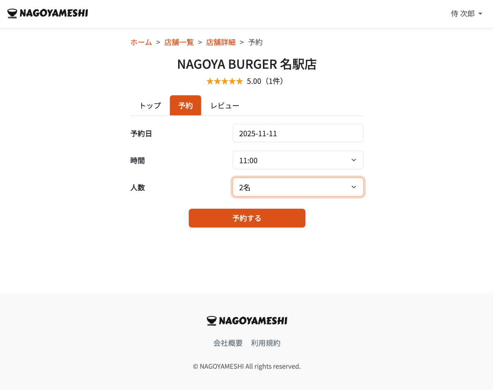

# 🍽️ NAGOYAMESHI

## 📸 スクリーンショット

**トップ画面**

**検索画面**

**店舗予約画面**

**レビュー投稿画面**

---

## 📝 概要

名古屋の飲食店検索・予約・レビュー投稿ができる**食べログ風アプリ**です。  
ユーザーは店舗を検索し、予約やレビュー投稿を通して利用体験を共有できます。
- 要件定義書：https://docs.google.com/document/d/1-1AZROOu5Fywvb3cdvymPQ8GlOKGWRHFyP_QCLTCcrc/edit?usp=sharing
---

## 🎯 制作背景

### 開発動機
地元・名古屋の飲食店をもっと手軽に探せる仕組みを作りたいという想いから開発を開始。  
実店舗とユーザーをつなぐ**地域密着型のアプリ**を、**Spring Boot単体で構築**することを目標にしました。

### 学習目的
- MVCアーキテクチャの理解と実装  
- Controller / Service / Repository 層の役割分担  
- Spring Securityによるログイン認証  
- 権限ごとに異なる画面遷移を実装  
- JPAを用いたORM設計  
- データベース操作の自動化  
- Thymeleafテンプレートエンジンの活用  
- サーバーサイドレンダリングによる動的HTML生成  

---

## 🛠️ 使用技術

### バックエンド

| 技術 | バージョン |
|------|-------------|
| Java | 21 |
| Spring Boot | 3.5.4 |
| Spring Security |  |
| Thymeleaf |  |
| MySQL | |
| JPA (Hibernate) |  |
| Stripe API | 決済機能実装用　28.2.0 |

### インフラ
- Heroku（デプロイ環境）  
- Maven（依存管理）  
- GitHub Actions（CI/CD）  

---

## ✨ 実装機能

### ユーザー機能
- ✅ 新規登録 / ログイン / ログアウト（Spring Security）
- ✅ パスワードリセット（メール送信機能）
- ✅ お気に入り登録・解除
- ✅ マイページで予約履歴・レビュー確認

### 店舗機能
- ✅ 店舗一覧 / 詳細表示 / カテゴリ別検索
- ✅ 予約登録・キャンセル（日時・人数入力）
- ✅ 定休日設定 / 営業時間表示
- ✅ レビュー投稿・編集・削除
- ✅ 平均評価の自動算出

### 管理者機能
- ✅ 店舗・カテゴリ・ユーザーのCRUD操作
- ✅ レビュー内容の管理（不正レビュー削除）
- ✅ 企業・利用規約ページ編集

### 企業向け機能
- ✅ 企業アカウント登録
- ✅ 店舗管理画面から自店舗の予約・レビューを確認

### 決済機能
- ✅ Stripe APIを利用した有料プラン登録
- ✅ Subscription管理

---

## 🔧 工夫した点

### 1. レイヤードアーキテクチャの徹底
```java
// Controller
@GetMapping("/restaurants")
public String listRestaurants(Model model) {
    model.addAttribute("restaurants", restaurantService.findAll());
    return "restaurants/index";
}

// Service
public List<Restaurant> findAll() {
    return restaurantRepository.findAll();
}
```

### 2. Spring Securityによる認証認可
```java
@Override
protected void configure(HttpSecurity http) throws Exception {
    http
        .authorizeHttpRequests()
            .requestMatchers("/admin/**").hasRole("ADMIN")
            .requestMatchers("/company/**").hasRole("COMPANY")
            .anyRequest().permitAll()
        .and()
            .formLogin()
            .loginPage("/login")
            .defaultSuccessUrl("/")
        .and()
            .logout()
            .logoutSuccessUrl("/");
}
```
一般ユーザー・企業・管理者それぞれに異なるアクセス制限を設定。

### 3. Stripe APIによるサブスクリプション決済
- StripeService.java でAPI連携処理を実装
- 有料会員登録時、Stripe側で課金・購読管理を実行

### 4. ThymeleafテンプレートでのUI生成
- サーバーサイドでHTMLを動的生成
- 管理画面・予約フォーム・レビュー投稿画面を統一デザインで構築

## 📂 ディレクトリ構成
```
nagoyameshi-springboot-app/
├── .gitattributes
├── .gitignore
├── Procfile                     # Herokuデプロイ設定
├── mvnw / mvnw.cmd              # Maven Wrapper（ビルドツール）
├── pom.xml                      # Maven設定ファイル（依存関係）
├── system.properties            # Javaバージョン設定（Heroku用）
├── .mvn/
│   └── wrapper/
│       └── maven-wrapper.properties
│
├── src/
│   └── main/
│       ├── java/
│       │   └── com/example/nagoyameshi/
│       │       ├── NagoyameshiApplication.java
│       │       ├── controller/
│       │       ├── entity/
│       │       ├── event/
│       │       ├── form/
│       │       ├── repository/
│       │       ├── security/
│       │       └── service/
│       └── resources/
│           ├── application-production.properties
│           ├── data.sql
│           ├── schema.sql
│           └── static/
│               ├── css/
│               └── images/
│
└── README.md
```

### 🚀 デプロイ
**Herokuで公開中**: https://nagoyameshi-app-2025-6a8adc2eb863.herokuapp.com/

### テストアカウント
- **一般ユーザー**: 検索・お気に入り のみ
  ID: taro.samurai@example.com　/ パスワード: password
- **有料ユーザー**: 予約・レビュー・決済 
  ID: jiro.samurai@example.com　/ パスワード: password
- **管理者**: 店舗/ユーザー/カテゴリ管理
  ID: hanako.samurai@example.com　/ パスワード: password

### テスト用Stripeカード番号
- **番号**：4242 4242 4242 4242
- **有効期限**：任意の未来日付
- **CVC**：任意の3桁

---

## 🔍 データベース設計

### ER図


---

## 📌 今後の実装予定
- [ ] レビューへの返信機能（施設側）
- [ ] 施設の写真複数枚アップロード
- [ ] 予約確認メールの自動送信
- [ ] 多言語対応（英語・中国語）

---

## 🎓 学んだこと
1. **Spring Securityによる複数権限管理の設計**  
2. **JPAエンティティ間リレーションの構築**  
3. **MVCパターンによる責務分離**  
4. **Stripe API連携による決済処理実装**  

---

## 📧 Contact
質問・フィードバックは以下までお願いします：
- **GitHub**: https://github.com/atakuya-12915
- **Email**: atakuya.wan@gmail.com

---

## 📄 License
このプロジェクトは学習目的で作成されたものです。商用利用は禁止します。