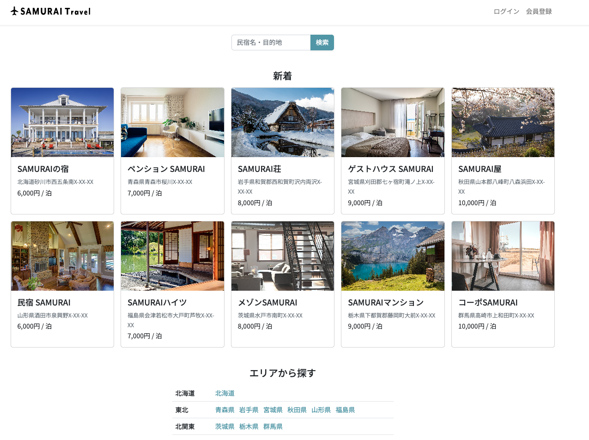

# SAMURAI travel

## 📸 スクリーンショット
- トップ画面


- 検索画面

- 店舗予約画面

- レビュー投稿画面

- 決済画面


---

## 📝 概要
民宿・ホテルの検索から予約、決済までを一貫して管理できる宿泊予約アプリです。  
「ユーザーが簡単に宿泊施設を探し、安心して予約できる仕組み」を目指して開発しました。

---

## 🎯 制作背景
### 学習目的
- **外部API連携の実装**：Stripe APIを使った決済機能の実装経験を積む
- **複雑なビジネスロジックの実装**：予約システムにおける在庫管理・日付処理の実践
- **トランザクション処理の理解**：予約データの整合性を保つためのDB設計

### こだわったポイント
1. **予約システムの実用性**  
   - カレンダーUIで宿泊日程を直感的に選択
   - 在庫数の自動チェックで予約の重複を防止
   - 予約履歴の確認・キャンセル処理まで実装

2. **Stripe API連携**  
   - テスト環境での決済フローを完全実装
   - Webhook処理で決済完了後の予約確定を自動化
   - エラーハンドリングで決済失敗時の適切な処理

3. **データ整合性の確保**  
   - Spring Bootの`@Transactional`を使った予約処理
   - 楽観的ロックで同時予約の競合を防止

---

## 🛠️ 使用技術
| 技術 | バージョン |
|------|-----------|
| **Java** | 17 |
| **Spring Boot** | 3.5.3 |
| **MySQL** |  |
| **Thymeleaf** | 3.1.2 |
| **Stripe API** | 決済機能実装用 |
| **Heroku** | - |

---

## ✨ 実装機能
### 一般ユーザー
- ✅ 会員登録・ログイン認証
- ✅ 宿泊施設の検索（エリア・価格帯・空室状況での絞り込み）
- ✅ 施設詳細表示（写真・設備・レビュー）
- ✅ カレンダーから宿泊予約（日付・人数指定）
- ✅ Stripe連携による決済機能（テスト環境）
- ✅ 予約履歴の確認・キャンセル処理
- ✅ レビュー投稿・閲覧機能

### 管理者
- ✅ 宿泊施設情報のCRUD操作
- ✅ 予約管理（予約一覧・ステータス変更）
- ✅ ユーザー管理

---

## 🔧 工夫した点

### 1. 外部API（Stripe）との連携実装
```java
// Stripeセッション作成
SessionCreateParams params = SessionCreateParams.builder()
    .addPaymentMethodType(PaymentMethodType.CARD)
    .setMode(Mode.PAYMENT)
    .setSuccessUrl(YOUR_DOMAIN + "/reservations/success?session_id={CHECKOUT_SESSION_ID}")
    .setCancelUrl(YOUR_DOMAIN + "/reservations/cancel")
    .addLineItem(lineItem)
    .build();

Session session = Session.create(params);
```
- Stripeの公式ドキュメントを読み込み、テスト環境での決済フローを実装
- Webhook処理で決済完了通知を受け取り、予約を確定

### 2. エラーハンドリングの徹底
- 予約可能人数を超えた場合の適切なエラーメッセージ表示
- 決済失敗時のリトライ処理
- DB接続エラー時のフォールバック処理

### 3. トランザクション処理による予約データの整合性確保
```java
@Transactional
public void createReservation(ReservationForm form) {
    // 在庫チェック
    if (!isAvailable(form.getHouseId(), form.getCheckInDate(), form.getCheckOutDate())) {
        throw new ReservationException("予約できません");
    }
    
    // 予約作成
    reservationRepository.insert(form);
    
    // 在庫更新
    inventoryRepository.decreaseStock(form.getHouseId(), form.getNumberOfPeople());
}
```
- `@Transactional`アノテーションで、予約処理全体をトランザクション化
- エラー発生時のロールバックで、データの不整合を防止

### 4. 日付処理の実装
- `LocalDate`を使った宿泊日数の計算
- 予約可能日のバリデーション（過去日の予約禁止など）

---

## 📂 ディレクトリ構成
```
src/
├── main/
│   ├── java/
│   │   └── com/example/samuraitravel/
│   │       ├── controller/        # コントローラー層
│   │       │   ├── ReservationController.java
│   │       │   ├── HouseController.java
│   │       │   └── StripeWebhookController.java
│   │       ├── service/            # ビジネスロジック層
│   │       │   ├── ReservationService.java
│   │       │   ├── StripeService.java
│   │       │   └── HouseService.java
│   │       ├── repository/         # データアクセス層
│   │       │   ├── ReservationRepository.java
│   │       │   └── HouseRepository.java
│   │       ├── entity/             # エンティティ
│   │       │   ├── Reservation.java
│   │       │   └── House.java
│   │       ├── form/               # フォームクラス
│   │       │   └── ReservationForm.java
│   │       └── exception/          # 例外クラス
│   │           └── ReservationException.java
│   └── resources/
│       ├── templates/              # Thymeleafテンプレート
│       │   ├── reservations/
│       │   ├── houses/
│       │   └── layout/
│       ├── static/                 # CSS/JS/画像
│       │   ├── css/
│       │   ├── js/
│       │   └── images/
│       ├── mapper/                 # MyBatis XMLマッパー
│       └── application.properties  # 設定ファイル
```

---

## 🚀 デプロイ
**Herokuで公開中**：https://samuraitraberu202507-4b2082511052.herokuapp.com/

### テストアカウント
- **一般ユーザー**：taro.samurai@example.com / password
- **管理者**：admin@example.com / password

### テスト用Stripeカード番号
- **番号**：4242 4242 4242 4242
- **有効期限**：任意の未来日付
- **CVC**：任意の3桁

---

## 🔍 データベース設計

### 主要テーブル
#### houses（宿泊施設）
| カラム名 | 型 | 説明 |
|---------|-------|------|
| id | INT | 主キー |
| name | VARCHAR | 施設名 |
| price | INT | 1泊料金 |
| capacity | INT | 収容人数 |
| address | VARCHAR | 住所 |

#### reservations（予約）
| カラム名 | 型 | 説明 |
|---------|-------|------|
| id | INT | 主キー |
| house_id | INT | 宿泊施設ID（外部キー） |
| user_id | INT | ユーザーID（外部キー） |
| check_in_date | DATE | チェックイン日 |
| check_out_date | DATE | チェックアウト日 |
| number_of_people | INT | 宿泊人数 |
| amount | INT | 合計金額 |

---

## 📌 今後の実装予定
- [ ] レビューへの返信機能（施設側）
- [ ] 施設の写真複数枚アップロード
- [ ] 予約確認メールの自動送信
- [ ] 多言語対応（英語・中国語）

---

## 🎓 学んだこと
1. **外部APIとの連携方法**  
   Stripe APIのドキュメントを読み込み、実装に落とし込む力

2. **決済システムの複雑さ**  
   決済フローの各ステップでのエラーハンドリングの重要性

3. **トランザクション処理の実践**  
   予約システムにおけるデータ整合性確保の難しさと実装方法

4. **日付処理のベストプラクティス**  
   `LocalDate`を使った安全な日付計算

---

## 📧 Contact
質問・フィードバックは以下までお願いします：
- **GitHub**: https://github.com/atakuya-12915
- **Email**: atakuya.wan@gmail.com

---

## 📄 License
このプロジェクトは学習目的で作成されたものです。商用利用は禁止します。